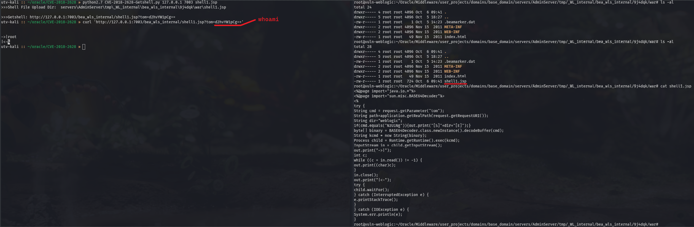
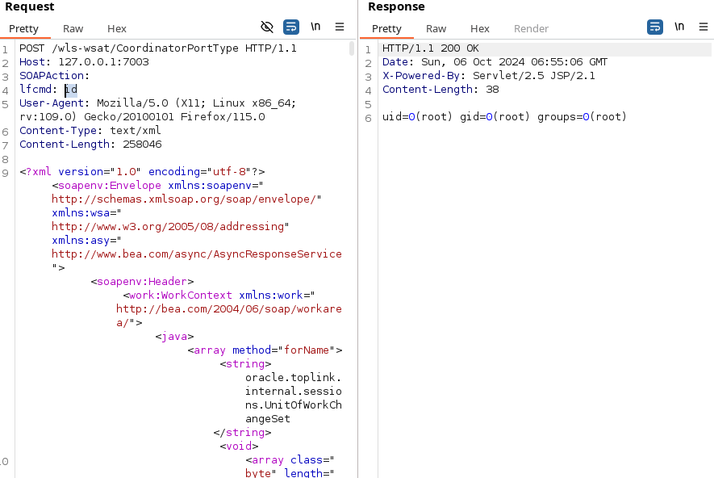
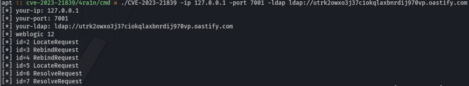
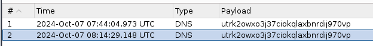
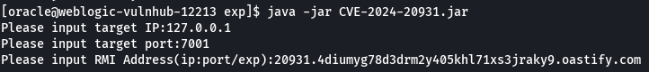
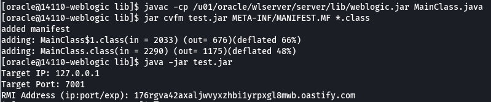
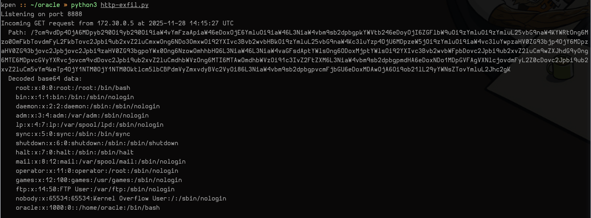

# WebLogic
## CVE-2018-2628
Additional information about CVE-2018-2628 can be found on my GitBook, [here](https://0xpthree.gitbook.io/notes/exploits-pocs/oracle/weblogic-cve-2018-2628).

---

## CVE-2019-2725
Additional information about CVE-2019-2725 can be found on my GitBook, [here](https://0xpthree.gitbook.io/notes/exploits-pocs/oracle/weblogic-cve-2019-2729).

Deserialization through `wls-wsat.war` and `wls9_async_response.war`. 

Payload [`burp-req01.txt`](cve-2019-2725/burp-req01.txt) tested successfully against VulnHubs WebLogic [10.3.6.0-2017](https://hub.docker.com/layers/vulhub/weblogic/10.3.6.0-2017/images/sha256-275ec19477cfda389dc1c42158033e7e8c650dd4cba9f090ca0ba673902b73c9?context=explore) container.

---

## CVE-2023-21839
Additional information about CVE-2023-21839 can be found on my GitBook, [here](https://0xpthree.gitbook.io/notes/exploits-pocs/oracle/weblogic-cve-2023-21839).

### Golang, exploiting IIOP

### Java, exploiting T3

---

## CVE-2024-20931
Additional information about CVE-2024-20931 can be found on my GitBook, [here](https://0xpthree.gitbook.io/notes/exploits-pocs/oracle/weblogic-cve-2024-20931).

---

## CVE-2024-21006
Additional information about CVE-2024-21006 can be found on my GitBook, [here](https://0xpthree.gitbook.io/notes/exploits-pocs/oracle/weblogic-cve-2024-21006).

---

# Identity Manager
## CVE-2025-61757
Additional information about CVE-2025-61757 can be found on my GitBook, [here](https://0xpthree.gitbook.io/notes/exploits-pocs/oracle/identity-manager-cve-2025-61757).

